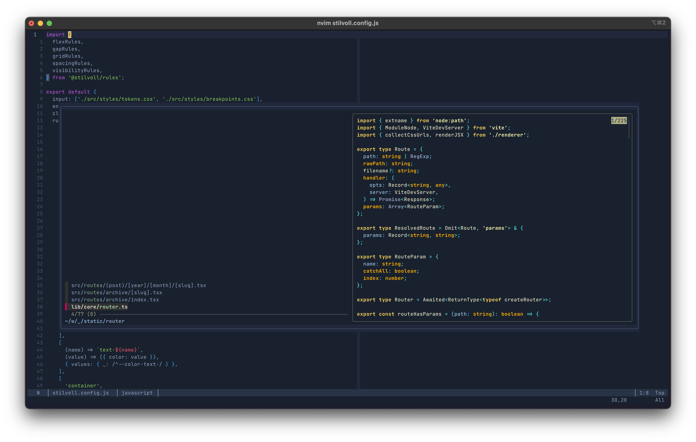

# NVIM Config

The goal of this configuration is to be as minimal as possible. While I don't have anything against
plugins per se, I think neovim has come a long way, and a lot of things can be done with what the
editor provides out of the box (like built-in support for LSPs). The only plugins it's installing
is `fzf` for fuzzy finding and `oil` as a better file navigator. 



## Installation
```bash
git clone git@github.com:lucasdinonolte/nvim-config.git ~/.config/nvim

# Install external LSP dependencies (if LSP support is wanted)
npm install -g @astrojs/language-server
npm i -g css-variables-language-server
npm i -g vscode-langservers-extracted
npm install -g cssmodules-language-server
npm install -g typescript typescript-language-server
brew install lua-language-server
```

## Useful resources
- [Collection of LSP configs using nvim 0.11’s built-in LSP](https://github.com/neovim/nvim-lspconfig/tree/master)
